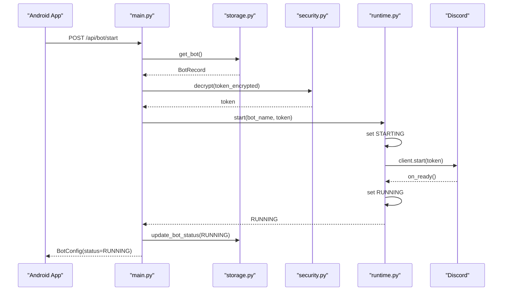

# Backend Architecture

## Scope

This document describes the current backend architecture for the Discord Bot Maker Android MVP. The backend is intentionally small: one FastAPI process, one SQLite database, one encrypted bot token, and one in-process Discord runtime.

## Main Components

### API layer

File: [backend/app/main.py](/E:/Users/aph97/discord-bot-maker-android/backend/app/main.py)

Responsibilities:

- Creates the FastAPI app and wires dependencies together.
- Exposes REST endpoints for bot registration, bot lifecycle, and AutoMod settings.
- Exposes a WebSocket endpoint for live logs.
- Resets persisted runtime state on boot if the previous process died while the bot was marked as running.

Routes:

- `GET /health`
- `GET /api/bot`
- `POST /api/bot`
- `POST /api/bot/start`
- `POST /api/bot/stop`
- `GET /api/automod`
- `PUT /api/automod`
- `GET /ws/logs`

### Runtime layer

File: [backend/app/runtime.py](/E:/Users/aph97/discord-bot-maker-android/backend/app/runtime.py)

Responsibilities:

- Implements the `RuntimeController` contract.
- Starts `discord.py` in a dedicated daemon thread.
- Tracks bot status with a small state machine.
- Emits lifecycle logs back to the API layer.

Status values:

- `NOT_CONFIGURED`
- `STOPPED`
- `STARTING`
- `RUNNING`
- `FAILED`

### Persistence layer

File: [backend/app/storage.py](/E:/Users/aph97/discord-bot-maker-android/backend/app/storage.py)

Responsibilities:

- Initializes SQLite tables.
- Stores bot configuration and AutoMod configuration.
- Enforces the current MVP constraint of exactly one bot and one AutoMod profile.

Tables:

- `bot_config`
- `automod_config`

Both tables are single-row by design through `CHECK (id = 1)`.

### Security layer

File: [backend/app/security.py](/E:/Users/aph97/discord-bot-maker-android/backend/app/security.py)

Responsibilities:

- Validates Discord token format.
- Masks tokens for API responses.
- Encrypts and decrypts tokens with Fernet.

Key loading order:

1. `BOT_MAKER_SECRET_KEY` environment variable
2. Local `token.key` file in `backend/.data/`
3. Generate a new key on first run

### Log fan-out

File: [backend/app/logging.py](/E:/Users/aph97/discord-bot-maker-android/backend/app/logging.py)

Responsibilities:

- Buffers a small in-memory log history.
- Tracks active WebSocket subscribers.
- Delivers log entries from the API thread and runtime thread into the active asyncio loop safely.

## Startup Wiring

`create_app()` builds the backend from four concrete services:

- `SqliteStore`
- `TokenCipher`
- `LogBroadcaster`
- `DiscordBotRuntime`

The same function also supports dependency injection for tests through `runtime_factory`, which lets tests swap the real Discord runtime for a fake one.

## Bot Registration Flow

1. `POST /api/bot` receives `botName` and `token`.
2. `security.py` validates the token format.
3. `security.py` encrypts the token with Fernet.
4. `storage.py` stores the encrypted token and the bot name in SQLite with status `STOPPED`.
5. `main.py` returns a masked token to the Android app.

The raw token is never persisted in plaintext.

## Bot Start Flow

Failure cases:

- If no bot exists, the API returns `404`.
- If the token fails Discord login, the runtime moves to `FAILED`.
- If startup throws another exception, the runtime also moves to `FAILED`.

## WebSocket Log Flow

1. The Android app connects to `GET /ws/logs`.
2. The API accepts the socket and sends an initial system message.
3. The socket subscribes to `LogBroadcaster`.
4. API handlers and the runtime call `emit()` to push `LogEntry` events.
5. Each subscriber receives log entries through its own asyncio queue.

This gives the phone a live console without polling.

## Data Model

Files:

- [backend/app/models.py](/E:/Users/aph97/discord-bot-maker-android/backend/app/models.py)
- [backend/app/storage.py](/E:/Users/aph97/discord-bot-maker-android/backend/app/storage.py)

Important models:

- `BotRegistrationRequest`
- `BotConfig`
- `AutoModConfig`
- `LogEntry`
- `BotRecord`

API models use Pydantic aliases so the HTTP surface stays Android-friendly:

- `botName`
- `tokenMasked`
- `hasToken`
- `linkBlocking`
- `whitelistLinks`
- `spamThreshold`
- `spamWindowSeconds`
- `muteMinutes`

## Current Architectural Constraints

These are deliberate MVP simplifications, not accidental omissions:

- Single process
- Single bot
- Single local SQLite database
- One encrypted token key per deployment
- In-process Discord runtime instead of a separate worker service
- Open CORS policy for local development convenience

## Main Risks In The Current Design

- Runtime start and stop are not serialized, so overlapping lifecycle requests can race.
- Runtime stop assumes the Discord event loop is still usable when closing the client.
- Bot names are trimmed after validation, which allows whitespace-only names to be stored.
- Encrypted tokens depend on one local Fernet key; losing or changing that key makes stored tokens unreadable.

## Tests

File: [backend/tests/test_api.py](/E:/Users/aph97/discord-bot-maker-android/backend/tests/test_api.py)

Current tests cover:

- invalid token rejection
- bot registration and fetch
- AutoMod save and load
- start and stop status transitions
- WebSocket log delivery

They do not currently cover runtime race conditions, shutdown edge cases, or key-rotation failures.
