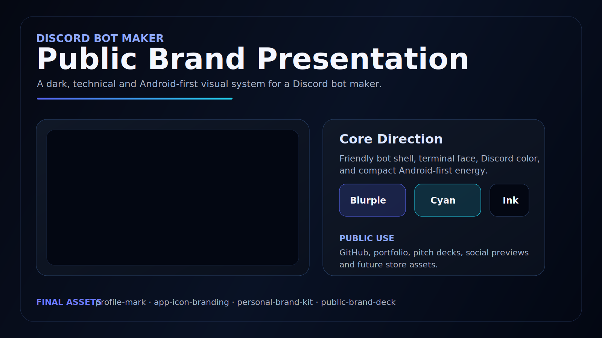

<p align="center">
  
</p>

<p align="center">
  <a href="https://github.com/Shin5hi/discord-bot-maker-android/actions/workflows/ci.yml">
    
  </a>
</p>

<p align="center">
  
</p>

<p align="center">
  
</p>

## At a Glance

<table>
  <tr>
    <td align="center" width="25%">
      <strong>Register</strong>
      <br>
      Save one bot name and token with local encryption.
    </td>
    <td align="center" width="25%">
      <strong>Start</strong>
      <br>
      Run the bot from the FastAPI backend without leaving the app.
    </td>
    <td align="center" width="25%">
      <strong>Watch</strong>
      <br>
      Stream runtime logs to the phone over WebSocket.
    </td>
    <td align="center" width="25%">
      <strong>Moderate</strong>
      <br>
      Load and save AutoMod settings from Android.
    </td>
  </tr>
</table>

## Visual Direction

Discord Bot Maker uses a Discord-inspired dark interface with blurple primary actions, charcoal surfaces, cyan runtime accents, and compact Android-first screens. The profile mark is intentionally rounded so it works as a repo avatar, app placeholder, or social preview asset, and the main README lockup now matches the final project face.

| Token | Color | Usage |
| --- | --- | --- |
| Blurple | `#5865F2` | Primary actions, selected states, bot identity |
| Cyan | `#31D0FF` | Runtime status, console highlights, active signals |
| Charcoal | `#171A21` | App surfaces and cards |
| Ink | `#0F1117` | Backgrounds |
| White | `#F5F7FF` | Primary text |

## Product Flow

```text
Android app
   |
   | register bot / edit AutoMod / start runtime
   v
FastAPI backend
   |
   | encrypt token + persist state
   v
SQLite + local key
   |
   | launch bot + emit events
   v
Discord runtime
   |
   | stream live logs
   v
Phone console
```

## Experience Pillars

| Surface | What the user feels |
| --- | --- |
| Android app | Clear, compact controls focused on one bot at a time |
| Backend | Local-first control plane that starts and stops the runtime |
| Console | Immediate feedback instead of guessing whether the bot is alive |
| AutoMod | Fast tuning of moderation behavior without touching code |

## MVP Scope

- Android app built with Jetpack Compose
- FastAPI backend with SQLite persistence
- Single-bot runtime managed by the backend
- Token storage encrypted with a local secret key
- Live log streaming over WebSocket
- AutoMod configuration save/load

Out of scope for this first hito:

- Kotlin Multiplatform
- Redis
- Hugging Face / Gemini moderation
- Telegram product integration
- Multi-user or multi-bot support
- Music module and slash-command builder

## Project Structure

```text
discord-bot-maker-android/
├── COORDINATION.md
├── README.md
├── app/
│   ├── build.gradle.kts
│   └── src/
│       ├── main/
│       │   ├── AndroidManifest.xml
│       │   ├── kotlin/com/discordbotmaker/android/
│       │   │   ├── MainActivity.kt
│       │   │   ├── app/
│       │   │   ├── data/
│       │   │   ├── feature/
│       │   │   └── ui/
│       │   └── res/
│       └── test/
├── backend/
│   ├── app/
│   │   ├── logging.py
│   │   ├── main.py
│   │   ├── models.py
│   │   ├── runtime.py
│   │   ├── security.py
│   │   └── storage.py
│   ├── tests/
│   ├── backend_api.py
│   └── pyproject.toml
├── build.gradle.kts
├── gradle.properties
├── gradlew
├── gradlew.bat
└── settings.gradle.kts
```

## Backend

### What it does

- `POST /api/bot` registers or updates the single bot
- `GET /api/bot` returns current bot state
- `POST /api/bot/start` starts the in-process bot runtime
- `POST /api/bot/stop` stops it
- `GET /api/automod` loads AutoMod
- `PUT /api/automod` saves AutoMod
- `GET /ws/logs` streams live log entries

### Run locally

```powershell
cd backend
python -m venv .venv
.venv\Scripts\python.exe -m pip install --upgrade pip
.venv\Scripts\python.exe -m pip install .
.venv\Scripts\uvicorn.exe backend_api:app --reload
```

Backend data is stored under `backend/.data/`:

- `discord_bot_maker.db` for SQLite
- `token.key` for local token encryption

## Android App

### What it does

- Stores the backend base URL locally
- Registers the bot with name + token
- Shows bot status and start/stop controls
- Opens the live console
- Loads and saves AutoMod

### Run locally

```powershell
.\gradlew.bat -p E:\Users\aph97\discord-bot-maker-android :app:assembleDebug
```

Or open the project root in Android Studio and run the `app` module.

### Run from Android Studio

1. Open `E:\Users\aph97\discord-bot-maker-android`
2. Wait for Gradle sync to finish
3. Start the backend locally
4. Run the `app` configuration on an emulator or device
5. In the app, use:
   - `http://10.0.2.2:8000` for the Android emulator
   - `http://<your-pc-lan-ip>:8000` for a physical Android phone

## Verification

Backend tests:

```powershell
backend\.venv\Scripts\python.exe -m pytest backend\tests\test_api.py -q
```

Android JVM tests:

```powershell
.\gradlew.bat -p E:\Users\aph97\discord-bot-maker-android :app:testDebugUnitTest
```

CI workflow:

- GitHub Actions runs backend tests, Android JVM unit tests, and `assembleDebug` on PRs and pushes to `main`
- Workflow file: [.github/workflows/ci.yml](/E:/Users/aph97/discord-bot-maker-android/.github/workflows/ci.yml)

## Play Store Path

The project is intended to be published on Google Play after the MVP is stable. Play Store work is deliberately treated as a release phase, not part of the first local MVP loop.

Before publishing:

- the Android app must pass local and CI builds
- the main phone flows must be tested on a real device or emulator
- the app needs a signed release build, store listing assets, privacy policy, data safety answers, and final branding screenshots
- backend connection expectations must be clear because the app controls a locally or externally hosted FastAPI server

Publishing readiness is tracked in [RELEASE_CHECKLIST.md](/E:/Users/aph97/discord-bot-maker-android/RELEASE_CHECKLIST.md).

## Codex Plugin Workflow

The repo keeps a minimal Codex plugin stack for day-to-day work. See [PLUGIN_STACK.md](/E:/Users/aph97/discord-bot-maker-android/PLUGIN_STACK.md).

Default stack:

- `GitHub` for repo-aware development
- `CodeRabbit` for review of risky changes
- `Superpowers` for structuring complex work and debugging
- `Test Android Apps` for validating visible Android behavior

Second-wave plugins such as `Linear`, `Slack`, or `Sentry` stay optional and are only adopted when the repo actually needs them.

Contribution and PR expectations are documented in [CONTRIBUTING.md](/E:/Users/aph97/discord-bot-maker-android/CONTRIBUTING.md).
Security handling is documented in [SECURITY.md](/E:/Users/aph97/discord-bot-maker-android/SECURITY.md).
Pre-release validation is documented in [RELEASE_CHECKLIST.md](/E:/Users/aph97/discord-bot-maker-android/RELEASE_CHECKLIST.md).

## Notes

- The backend runtime uses `discord.py` in-process.
- A valid Discord bot token is still created beforehand in the Discord Developer Portal.
- The Android app now uses a Discord-inspired dark UI with official blurple branding cues and darker charcoal surfaces.
